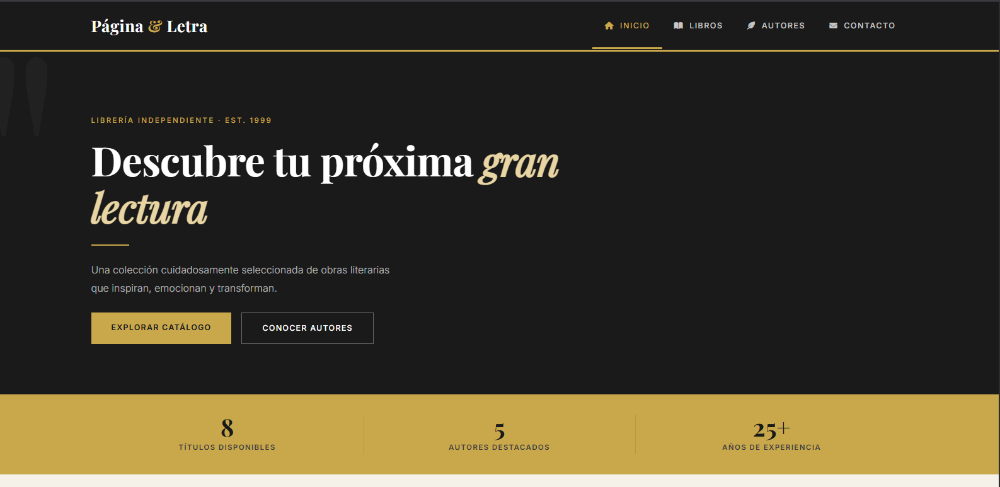
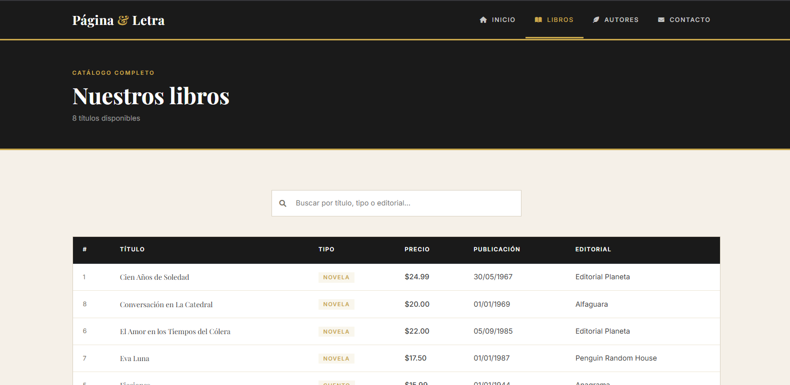
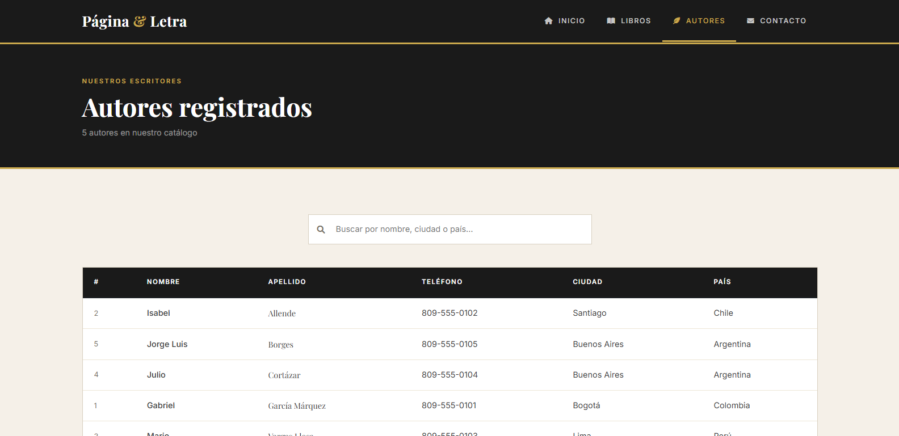
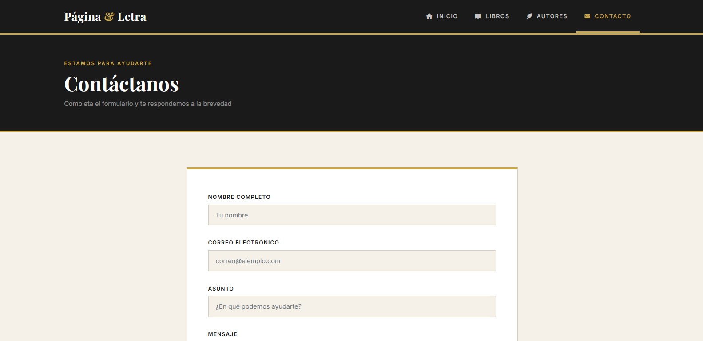

# 📚 Página & Letra — Librería Online

Sistema web de librería desarrollado con PHP y MySQL. Permite visualizar el catálogo de libros, consultar autores registrados y enviar mensajes de contacto.

---

## 🖼️ Vista previa

### Página de inicio


### Catálogo de libros


### Autores


### Formulario de contacto


---

## 🚀 Tecnologías utilizadas

- **PHP 8** — lógica del servidor
- **MySQL** — base de datos relacional
- **Bootstrap 5** — diseño responsive
- **Playfair Display + Inter** — tipografía editorial
- **XAMPP** — entorno de desarrollo local

---

## 📁 Estructura del proyecto
libreria/
├── index.php
├── libros.php
├── autores.php
├── contacto.php
├── procesar_contacto.php
├── config/
│   └── database.php
├── includes/
│   ├── header.php
│   └── footer.php
├── css/
│   └── styles.css
└── js/
└── script.js

---

## 🗄️ Base de datos

| Tabla | Descripción |
|-------|-------------|
| `titulos` | Catálogo de libros disponibles |
| `autores` | Autores registrados |
| `publicadores` | Editoriales |
| `contacto` | Mensajes recibidos del formulario |

---

## ⚙️ Instalación local

1. Clona el repositorio:
```bash
git clone https://github.com/Rosdevdr/proyecto_web_local.git
```

2. Copia la carpeta `libreria` a `C:\xampp\htdocs\`

3. Inicia **Apache** y **MySQL** en XAMPP

4. Abre `http://localhost/phpmyadmin` y ejecuta el SQL de la base de datos

5. Abre en el navegador:
http://localhost/libreria/

---

## 🌐 Demo en línea

👉 [Ver sitio en vivo](https://proyecto-libreria-local.kesug.com/)

---

## 🔧 Configuración

1. Clona el repositorio
2. Copia `.env.example` como `.env`
3. Edita `.env` con tus credenciales de base de datos
4. ¡Listo para usar!

**Nota:** El archivo `.env` contiene credenciales sensibles.

---

## 👨‍💻 Autor

Desarrollado por **Rosdevdr** — 2026
